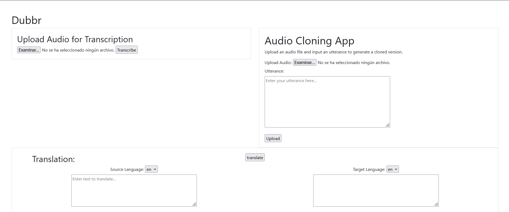

# Dubbr

Dubbr es un proyecto que integra tres repositorios de GitHub para crear una caja de herramientas en la que los usuarios sin experiencia en ML puedan doblar audio a Ingles y proximamente a múltiples idiomas.

## Introducción

Dubbr se creó como parte de mi proyecto de máster. Su propósito principal es abordar el desafío de la falta de contenido multilingüe en Internet, lo que crea barreras para las personas. Este repositorio tiene como objetivo proporcionar a los creadores de contenido individuales la capacidad de doblar su audio a múltiples idiomas. este repositorio todavia necesita desarrollo , puede transcribir y traducir a una varidad de idiomas pero solo genera audio en ingles

## Características

Dubbr combina los siguientes tres repositorios para proporcionar sus características clave:

1. [LibreTranslate](https://github.com/LibreTranslate/LibreTranslate)
2. [Vosk-API](https://github.com/alphacep/vosk-api)
3. [Voice-Clone-Application-Flask-Web-App](https://github.com/Sba-Stuff/Voice-Clone-Application-Flask-Web-App.git)

Características clave:
- Transcribir audio utilizando Vosk-API.
- Traducir el texto transcrito utilizando LibreTranslate.
- Crear clones de voz del texto traducido utilizando Real-Time-Voice-Cloning.

Lo que distingue a Dubbr es que ofrece una solución de código abierto para esta tarea y ha sido optimizado para ejecutarse en CPU, lo que lo hace accesible para una amplia gama de usuarios.

## Comenzar

### Prerrequisitos

Para utilizar Dubbr, debe tener Docker instalado.

### Instalación

Para configurar Dubbr, siga estos pasos:

1. Clonar el repositorio:

### Download Pretrained Models
Download the latest [here](https://github.com/CorentinJ/Real-Time-Voice-Cloning/wiki/Pretrained-models/2cd3887f379d4921b193214973b463043efa5c23).

asegurarse de que los modelos estan el sitio correcto

vocoder/saved_models/pretrained/pretrained.pt

synthesizer/saved_models/logs-pretrained/taco_pretrained/tacotron_model.ckpt-278000.data-00000-of-00001

encoder\saved_models\pretrained.pt

2. Ir al directorio del proyecto:

3a. Iniciar el proyecto con Docker Compose:
docker-compose up

3b. Crear entorno virtuel:
Python 3.6 or 3.7 is needed to run the toolbox.

    virtualenv entorno
    Instalar PyTorch (>=1.0.1).
    Instalar ffmpeg.
    Usar el comando pip Install -r requirements.txt para Instalar los paquetes necesarios
    Tambien Instalar Flask con pip usando el comando pip install Flask
    lanzar la aplicacion con python server.py

Dubbr estará disponible en http://127.0.0.1:5000/ una vez que esté en funcionamiento.

## Uso

Los usuarios pueden utilizar Dubbr de manera efectiva moviéndose entre diferentes componentes de la aplicación. Aquí tienes un escenario de uso básico:

1. Subir audio para su transcripción.
2. Recibir el resultado de la transcripción.
3. Traducir la transcripción a múltiples idiomas.
4. Generar clones de voz para el texto traducido.

## ejemplo
Original:
<audio controls>
  <source src="static/alphabet.mp3" type="audio/mpeg">
  Your browser does not support the audio element.
</audio>

creado:
<audio controls>
  <source src="static/a long time ago, the second December, a cup of water.wav" type="audio/mpeg">
  Your browser does not support the audio element.
</audio>

puedes ver mas ejemplos y audios de prueba en la carpeta static

## Licencia

Este proyecto está bajo la Licencia MIT. Consulta el archivo [LICENSE.md](LICENSE.md) para obtener más detalles.
